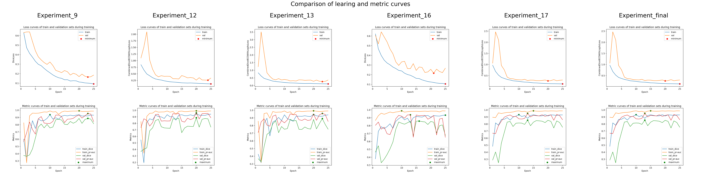

# Brief report on the approach and results of the challenge

## 1. Dataset exploration

As a first step to the challenge, in the [exploration notebook](../notebooks/00_Explore_data.ipynb) the data was visualized and some initial observations made. This step is important to know what preprocessing steps need to be applied to prepare the data for training

## 2. Set up custom dataset class

The modular approach begins here in the [data manipulation module](../src/data/) with [dida_dataset.py](../sr/data/dida_dataset.py). Here, a custom dataset class has been defined where the data is split into train and validation set and prepared for training by applying transforms.

## 3. Dataloaders

The actual data is loaded by creating separate dataloaders for train and val. The transforms to be applied are defined here. Initially only the ToTensor transform is used to check the performance. After a baseline is established, other augmentations such as random flipping and color transforms are applied. 

## 4. Set up main script along with utils for supporting functions

The main script is the one that will be contain the whole pipeline of getting dataloaders, setting up loss functions, training and predicting. All support functions will be in the utils script. 

## 5. Model and Loss functions

Here, the model architecture to be used, the training script and custom loss functions are defined. After doing a brief literature review, DeepLabV3, SOTA in image segmentation space, was chosen with resnet-101 backbone. PyTorch also has pretrained weights available for the model. Some of the advantages of using this model architecture:
* The use of dilated convolutions so as to not lose spatial resolution of features - denser feature extraction. 
* Using Atrous Spatial Pyramid Pooling (ASPP) instead of maxpooling with different dilation rates - this is concatenated so as improve segmentation performance. This is because of the different dilation rates that help accommodate objects in multiple scales in an image (rooftops can be of different sizes)

The loss function first used was BCEWithLogitsLoss(), the intial results looked promising. Later, DiceLoss, CombinedLoss, WeightedCombinedLoss were experimented with. Since DiceLoss is better suited for segmentation tasks since it is based on the metric Dice Coefficient which is one of the main metrics used. 

## 6. Performance metrics

a. Dice coefficient is the most widely used metric for segmentation as it not only measures the correctly labeled pixels as in the case of accuracy, but also penalizes the false positives. 

b. Area under the Precision Recall Curve - Since dice coefficient is dependent on a threshold value, PR-AUC gives us a measure of the model's performance independent of threshold values.

## 7. Logging and visualization

The configuration used in [config.yaml](../src/config.yaml) is logged, along with training logs in log.csv in the respective experiment folder in [models folder](../models/). Further, the loss curves and the metric curves are also saved during the training. Finally, after the training, in the prediction phase, based on the config, predictions for test data (unlabelled data), train data and validation data are all made and images are saved in test_predictions, train_predictions, val_predictions respectively. Additionally, in the case of train and val data, the metrics per sample and averaged across samples are saved in metrics.json within the respective predictions folder. 

------------
## Experiments

All the experiments that are logged were run on colab. When colab GPU wasn't available, local machine with a 4GB GeForce 940MX was used to try some training modification ideas. 

To run the predict.py or main.py on colab, a notebook that was used to run experiments is available in [01_run_experiments_colab.ipynb](../notebooks/01_run_experiments_colab.ipynb)

The following experiments were tried:

a. Dice, BCE, combined, weighted combined 
b. Threshold values
c. Different learning rates
d. Normalizing data with imagenet stats
e. Augmentations - geometric, color

The final results are [here](../models/final). Here the configuration used for the run is in [config.json file](../models/final/config.json). The final model was chosen based on the dice and pr-auc metrics, and the smoothness of the learning curve so as to ensure robustness. The hyperparameters used were a learning rate of 0.0003, a threshold value of 0.4, all the augmentations, and a weighted combination of dice and BCE loss with BCE loss weighed at 0.5. Normalizing the data with imagenet stats worsened the performance so this was not used. 

Here is the comparison of the metrics:

Here is the comparison of the learning curves of selected learning curves:

The final predictions can be found in the models folder under [final](../models/final/test_predictions/)

------------

## Limitations:

* DeepLabv3+ could not be used as the pre-trained weights were not available from pytorch (a trusted source). It might help to utilize this using tensorflow keras framework since pretrained weights are made available.

* It is visible from the results that existence of shadow can affect the segmentation performance. A possible solution has been provided in [this paper](https://papers.ssrn.com/sol3/papers.cfm?abstract_id=4029444) by Yang et al. Since the images are photographed (high resolution) and not remote sensing images (low resolution), the viability of the approach needs to be verified. 

* Using MLFlow for experiment tracking would be much better for a long term project.

* Cross-validation would be a better approach so as to not overfit. However, due to large computational costs, CV is often avoided in Deep Learning. The validation set (without augmentation) was used here as the hold-out test set due to the limited data availability (30 samples) here. The ideal way to do it would be to split into train-val-test set and test set is used to pick the final hyperparameter setting.

* Other optimizers like SGD, RMSprop may be tried. 

-------------

## References:

https://pytorch.org/vision/main/models/generated/torchvision.models.segmentation.deeplabv3_resnet101.html#torchvision.models.segmentation.deeplabv3_resnet101

Chen, L. C., Papandreou, G., Schroff, F., & Adam, H. (2017). Rethinking atrous convolution for semantic image segmentation. arXiv preprint arXiv:1706.05587.

Yang, Lan and Chen, Wei and Bi, Pengshuai and Tang, Hongzhao and Zhang, Fengjiao and Wang, Zhe, Improving Vegetation Segmentation with Shadow Effects Based on Double Input Networks Using Polarization Images. Available at SSRN: https://ssrn.com/abstract=4029444 or http://dx.doi.org/10.2139/ssrn.4029444 

https://www.v7labs.com/blog/mean-average-precision#h3

